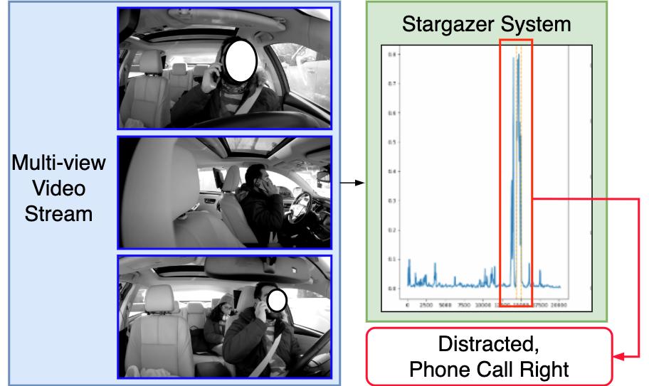
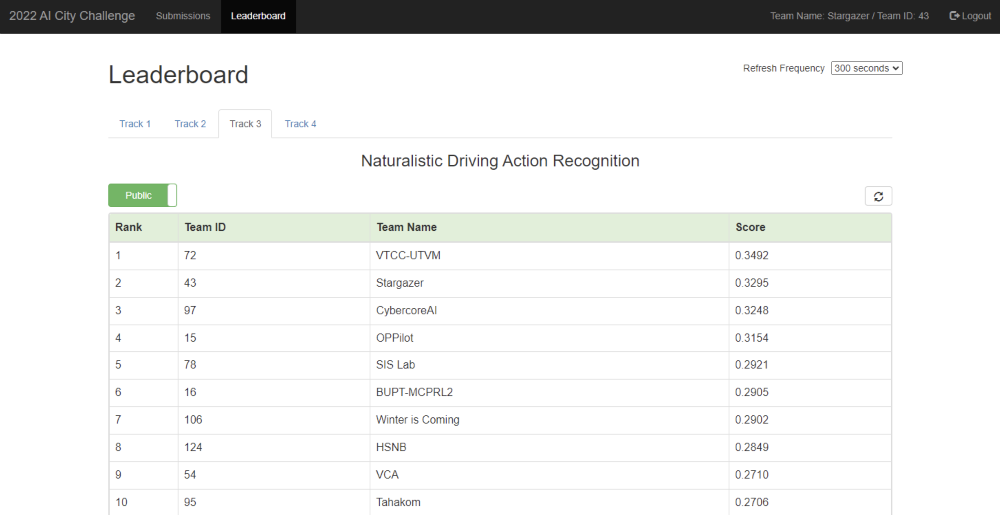

# Modified PySlowFast (with MViT v2) for AI City Challenge

## Introduction

  The AI City Challenge's [Naturalistic Driving Action Recognition](https://www.aicitychallenge.org/2022-challenge-tracks/) intends to temporally localize driver actions given multi-view video streams. 
  Our system, the Stargazer system, achieves **second-place** performance on the [public leaderboard](https://arxiv.org/pdf/2204.10380.pdf) and third-place in the [final test](https://www.aicitychallenge.org/2022-challenge-winners/). 
  Our system is based on the [improved multi-scale vision transformers](https://arxiv.org/abs/2112.01526) and large-scale pretraining on the Kinetics-700 dataset. Our CVPR workshop paper detailing the designs is [here](https://openaccess.thecvf.com/content/CVPR2022W/AICity/papers/Liang_Stargazer_A_Transformer-Based_Driver_Action_Detection_System_for_Intelligent_Transportation_CVPRW_2022_paper.pdf).

  <div align="center">
    <div style="">
        
        
    </div>
  </div>

## Citations
If you find this code useful in your research then please cite

```
@inproceedings{liang2022stargazer,
  title={Stargazer: A transformer-based driver action detection system for intelligent transportation},
  author={Liang, Junwei and Zhu, He and Zhang, Enwei and Zhang, Jun},
  booktitle={Proceedings of the IEEE/CVF Conference on Computer Vision and Pattern Recognition},
  pages={3160--3167},
  year={2022}
}
```

## Requirement
  + ffmpeg >= 3.4 for cutting the videos into clips for training.
  + python 3.8, tqdm, decord, opencv, pyav, pytorch>=1.9.0, fairscale

## Data Preparation
  1. Put all videos into a single path under `data/A1_A2_videos/`. There should be 60 ".MP4" under this directory
  2. Download our processed annotations from [here](https://drive.google.com/file/d/1-Xj0HsYJqsA_mdrTBUijp4GHSr8Zrin6/view?usp=sharing). This annotation simply re-formats the original annotation. Put the file under `data/annotations/`

  3. Generate files for training on A1 videos.

     + Get the processed annotations and video cutting cmds

       ```
       $ python scripts/aicity_convert_anno.py data/annotations/annotation_A1.edited.csv \
       data/A1_A2_videos/ data/annotations/processed_anno_original.csv \
       A1_cut.sh data/A1_clips/ --resolution=-2:540
       ```
       The `processed_anno_original.csv` should have 1115 lines.

     + Cut the videos (you can also directly run bash).

       ```
       $ mkdir data/A1_clips
       $ parallel -j 4 < A1_cut.sh
       ```

     + Make annotation splits (without empty segments, see paper for details)

       ```
       $ python scripts/aicity_split_anno.py data/annotations/processed_anno_original.csv \
       data/annotations/pyslowfast_anno_na0 --method 1
       ```

     + Make annotation splits (with empty segments)

       ```
       $ python scripts/aicity_split_anno.py data/annotations/processed_anno_original.csv \
       data/annotations/pyslowfast_anno_naempty0 --method 2
       ```

     + Make annotation files for training on the whole A1 set

       ```
       $ mkdir data/annotations/pyslowfast_anno_na0/full
       $ cat data/annotations/pyslowfast_anno_na0/splits_1/train.csv \
       data/annotations/pyslowfast_anno_na0/splits_1/val.csv \
       > data/annotations/pyslowfast_anno_na0/full/train.csv
       $ cp data/annotations/pyslowfast_anno_na0/splits_1/val.csv \
       data/annotations/pyslowfast_anno_na0/full/
       ```

     + download pre-trained K700 checkpoints from [here](https://drive.google.com/file/d/1wn1392Kn6CFxcSH6lJpqZky9-PJxqTlY/view?usp=sharing). Put the `k700_train_mvitV2_full_16x4_fromscratch_e200_448.pyth` under `models/`. This model achieves 71.91 top-1 accuracy on Kinetics700 validation sets.

## Training
  Train using the 16x4, 448 crop K700 pretrained model on A1 videos for 200 epochs, as in the paper.
  Here we test it with a machine with 3-GPUs (11GB memory per GPU). The code base supports multi-machine training as well.

  First we need to add the code file path (root path) to PYTHONPATH:

  ```
    $ export PYTHONPATH=$PWD/:$PYTHONPATH;
  ```

  Remove `Dashboard_User_id_24026_NoAudio_3.24026.533.535.MP4` from `data/annotations/pyslowfast_anno_na0/full/train.csv`.

  Train:

  ```
    $ mkdir -p exps/aicity_train
    $ cd exps/aicity_train
    $ python ../../tools/run_net.py --cfg ../../configs/VITV2_FULL_B_16x4_CONV_448.yaml \
    TRAIN.CHECKPOINT_FILE_PATH ../../models/k700_train_mvitV2_full_16x4_fromscratch_e200_448.pyth \
    DATA.PATH_PREFIX ../../data/A1_clips \
    DATA.PATH_TO_DATA_DIR ../../data/annotations/pyslowfast_anno_na0/full \
    TRAIN.ENABLE True TRAIN.BATCH_SIZE 3 NUM_GPUS 3 TEST.BATCH_SIZE 3 TEST.ENABLE False \
    DATA_LOADER.NUM_WORKERS 8 SOLVER.BASE_LR 0.000005 SOLVER.WARMUP_START_LR 1e-7 \
    SOLVER.WARMUP_EPOCHS 30.0 SOLVER.COSINE_END_LR 1e-7 SOLVER.MAX_EPOCH 200 LOG_PERIOD 1000 \
    TRAIN.CHECKPOINT_PERIOD 100 TRAIN.EVAL_PERIOD 200 USE_TQDM True \
    DATA.DECODING_BACKEND decord DATA.TRAIN_CROP_SIZE 448 DATA.TEST_CROP_SIZE 448 \
    TRAIN.AUTO_RESUME True TRAIN.CHECKPOINT_EPOCH_RESET True \
    TRAIN.MIXED_PRECISION False MODEL.ACT_CHECKPOINT True \
    TENSORBOARD.ENABLE False TENSORBOARD.LOG_DIR tb_log \
    MIXUP.ENABLE False MODEL.LOSS_FUNC cross_entropy \
    MODEL.DROPOUT_RATE 0.5 MVIT.DROPPATH_RATE 0.4 \
    SOLVER.OPTIMIZING_METHOD adamw
  ```

  The model we used that ranks No.2 on the leaderboard was trained using 2x8 A100 GPUs with a global batch size of 64 and a learning rate of 1e-4 (also with gradient check-pointing but no mixed precision training). So for a 3-GPU train, we use a batch size of 3 and a learning rate of 0.000005 according to the linear scaling rule. However, in order to reproduce our results, a similar number of batch size is recommended.

  To run this code on multi-machine with PyTorch DDP, add `--init_method "tcp://${MAIN_IP}:${PORT}" --num_shards ${NUM_MACHINE} --shard_id ${INDEX}` to the commands. `${MAIN_IP}` is the IP for the root node. `${INDEX}` is the node's index.

## Inference
  To get submission file for a test dataset, we need the model, threshold file, the videos, and the video_ids.csv.

  1. Get the model

     Follow the Training process or download our checkpoint from [here](https://drive.google.com/file/d/12LQ_2iZZyFJcUjJ6zpU1CcHCbYEmoGJs/view?usp=sharing). Put the models under `models/`. This is the model that achieves No.2 on the A2 leaderboard.

  2. Get the thresholds. Put them under `thresholds/`.

     + Best public leaderboard threshold from [here](https://drive.google.com/file/d/1_TqeoV7MEuVp0LzlN99t3Kj5TvG-1Ry5/view?usp=sharing). (Empirically searched)

     + Best general leaderboard threshold from [here](https://drive.google.com/file/d/1xu3heJctorJ5QDyXCL2z81cUb3B3cwoN/view?usp=sharing). (Grid searched)

     + A1 pyslowfast_anno_naempty0/splits_1 trained and empirically searched from [here](https://drive.google.com/file/d/14gBk-mckw3eKKGu-rJtW2crn_z-4f9ug/view?usp=sharing).

  3. Run sliding-window classification (single GPU).

     Given a list of video names and the path to the videos, run the model.
     16x4, 448 model with batch_size=1 will take 5 GB GPU memory to run.

     ```
      # cd back to the root path
      $ python scripts/run_action_classification_temporal_inf.py A2_videos.lst data/A1_A2_videos/ \
      models/aicity_train_mvitV2_16x4_fromk700_e200_lr0.0001_yeswarmup_nomixup_dp0.5_dpr0.4_adamw_na0_full_448.pyth \
      test/16x4_s16_448_full_na0_A2test \
      --model_dataset aicity --frame_length 16 --frame_stride 4 --proposal_length 64 \
      --proposal_stride 16 --video_fps 30.0  --frame_size 448 \
      --pyslowfast_cfg configs/Aicity/MVITV2_FULL_B_16x4_CONV_448.yaml \
      --batch_size 1 --num_cpu_workers 4
     ```

  4. Run post-processing with the given threshold file to get the submission files.

     ```
     $ python scripts/aicity_inf.py test/16x4_s16_448_full_na0_A2test thresholds/public_leaderboard_thres.txt \
     A2_video_ids.csv test/16x4_s16_448_full_na0_A2test.txt --agg_method avg \
     --chunk_sort_base_single_vid score --chunk_sort_base_multi_vid length --use_num_chunk 1
     ```

     The submission file is `test/16x4_s16_448_full_na0_A2test.txt`. This should get F1=0.3295 as on the leaderboard on A2 test.

## Acknowledgement
  This code base heavily adopts the [PySlowFast](https://github.com/facebookresearch/SlowFast) code base.
